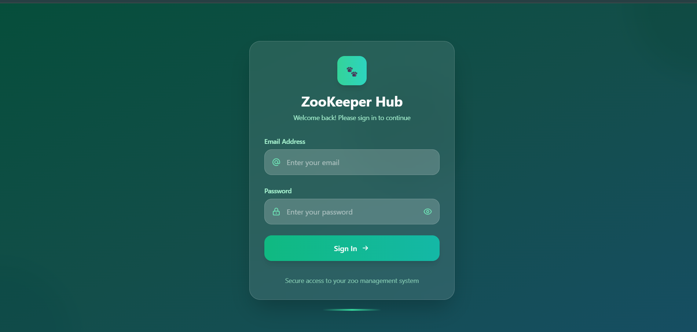
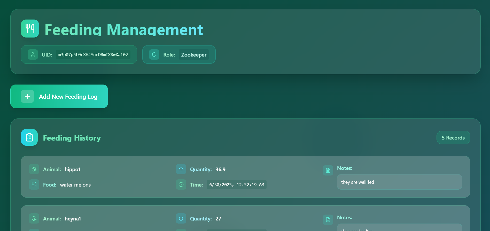
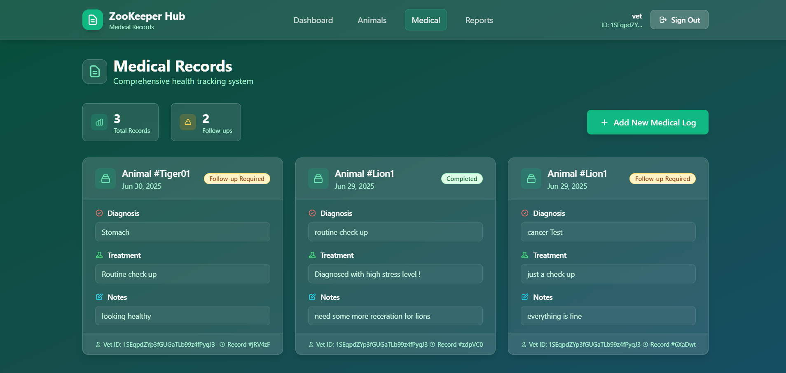
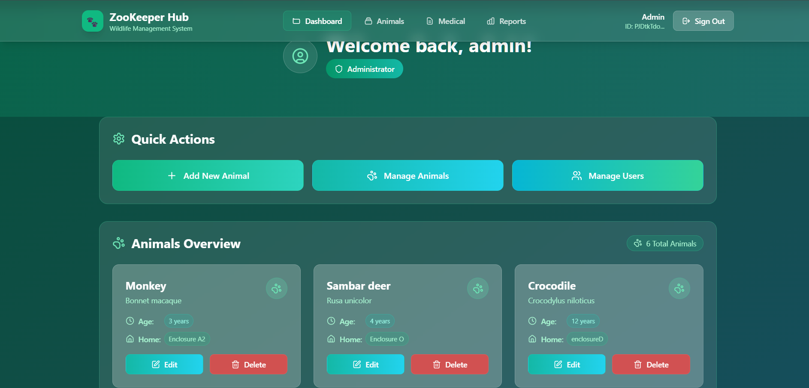
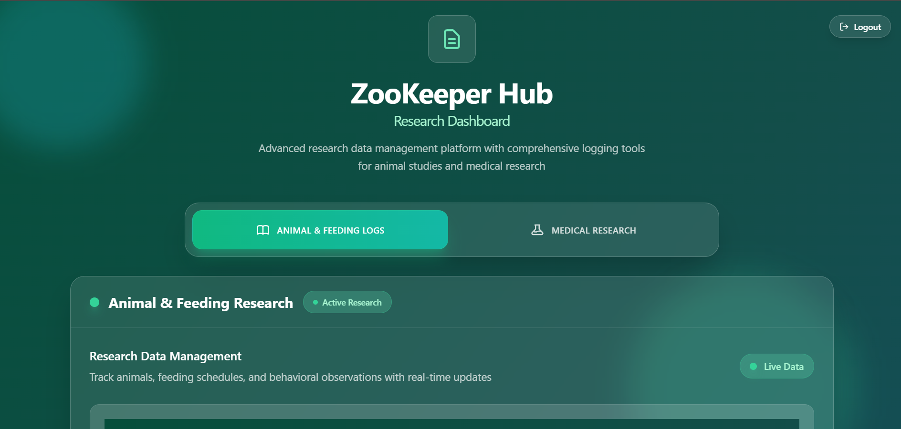

# 🐾 ZooKeeper Hub – Role-Based Wildlife Management Platform

**ZooKeeper Hub** is a dynamic, role-based web application built for modern zoos to manage animal welfare collaboratively and securely. It empowers **Admins**, **Zookeepers**, **Vets**, and **Researchers** through personalized access and responsibilities—**because not every user should see or do the same things!**

🔐 Powered by **Role-Based Access Control (RBAC)**
🌍 Deployed live: [zookeeper-hub.vercel.app](https://zookeeper-hub.vercel.app)


---

## 🎯 Why ZooKeeper Hub?

In real-world zoos, data confidentiality and task distribution are key. **ZooKeeper Hub** brings that same discipline to the digital space by assigning **specific permissions to each role**, ensuring that:

* Admins **manage** the system.
* Zookeepers **log** daily animal feedings.
* Vets **record** medical treatments.
* Researchers **analyze**, but cannot modify, sensitive data.

No more shared dashboards. No more access leaks. Just **secure, structured control**.

---

## ✨ Role-Based Feature Breakdown

| 👤 Role              | 🔧 What They Can Do                                                          |
| -------------------- | ---------------------------------------------------------------------------- |
| 👑 **Admin**         | Full control: Add/edit/delete animals, manage users, assign roles            |
| 🧑‍🌾 **Zookeeper**  | Submit daily feeding logs for each animal                                    |
| 🧑‍⚕️ **Vet**        | Log medical reports, monitor animal health status                            |
| 🧑‍🔬 **Researcher** | View-only access to analyze animal and health records for studies or reports |

---

## 🖼️ App Preview

| Login                         | Dashboard                    | Feeding Log                     | Medical Log                     |
| ----------------------------- | ---------------------------- | ------------------------------- | ------------------------------- |
|  |  |  |  |

| Admin Panel                   | Researcher View                  |
| ----------------------------- | -------------------------------- |
|  |  |

---

## ⚙️ Built With

* 🧠 **React** + **Tailwind CSS** — sleek and responsive frontend
* 🔐 **Firebase Auth** — secure login and role tracking
* 📦 **Firestore** — cloud database for real-time data
* 🧭 **React Router v6** — intuitive and protected route navigation
* 🚀 **Vercel** — seamless CI/CD deployment

---

## 🧩 Project Structure

```
zookeeper-hub/
├── src/
│   ├── pages/           # Page-level components
│   ├── components/      # UI, forms, layout modules
│   ├── contexts/        # Auth context & provider
│   ├── hooks/           # Custom hooks (e.g. useAuth)
│   └── firebase.js      # Firebase config setup
└── public/screens/      # Screenshots for documentation
```

---

## 🧪 Getting Started Locally

1. **Clone this repo**

   ```bash
   git clone https://github.com/sharavana07/zookeeper-hub.git
   cd zookeeper-hub
   ```

2. **Install dependencies**

   ```bash
   npm install
   ```

3. **Add your Firebase project config**
   Create a `.env` file and paste:

   ```env
   VITE_API_KEY=your_api_key
   VITE_AUTH_DOMAIN=your_project.firebaseapp.com
   VITE_PROJECT_ID=your_project_id
   VITE_STORAGE_BUCKET=your_project.appspot.com
   VITE_MESSAGING_SENDER_ID=your_sender_id
   VITE_APP_ID=your_app_id
   ```

4. **Run the development server**

   ```bash
   npm run dev
   ```

---

## 🚀 Deployment

> The app is live on **[Vercel](https://vercel.com/)** with automatic deployment from the `main` branch.

No manual deployments needed—just push and go!

---

## 🧑‍💻 Creator & Contributor

|                        |
| :-----------------------------------------------------------------------------------: |
| [Sharavana Ragav](https://github.com/sharavana07)<br/>🚀 Developer & System Architect |

---

## 💡 Future Plans

* ✅ Role-Based Access Control (RBAC)
* 🔄 Role editor UI for Admins
* 📊 Analytics for researchers
* 🐛 Bug reporting module
* 🔔 Email or push notifications for feeding/medical deadlines

---

## 📜 License

MIT © 2025 — [Sharavana Ragav](https://github.com/sharavana07)

---
